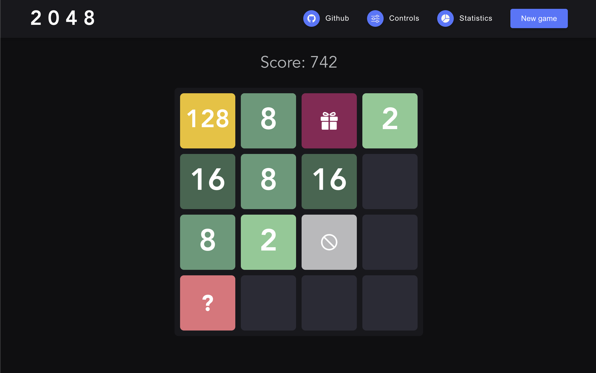

  <h1 align="center">Revisited 2048 game</h1>
  

    
  

  

     
    A revisited 2048 game, using laws of mathematical probabilities.
  

 

  

 

## General

### Original game

2048 is a **single-player sliding tile puzzle video game** written by Italian web developer [Gabriele Cirulli](https://twitter.com/gabrielecirulli). You can play the original game [here](https://play2048.co/).

### Rules

> Source: [Wikipedia](<https://en.wikipedia.org/wiki/2048_(video_game)#Gameplay>)

2048 is played on a plain 4×4 grid, with numbered tiles that slide when a player moves them using the four arrow keys. Every turn, a new tile randomly appears in an empty spot on the board with a value of either `2` or `4`. Tiles slide as far as possible in the chosen direction until they are stopped by either another tile or the edge of the grid. If two tiles of the same number collide while moving, they will merge into a tile with the total value of the two tiles that collided. The resulting tile cannot merge with another tile again in the same move

If a move causes three consecutive tiles of the same value to slide together, only the two tiles farthest along the direction of motion will combine. If all four spaces in a row or column are filled with tiles of the same value, a move parallel to that row/column will combine the first two and last two. The user's score starts at zero, and is increased whenever two tiles combine, by the value of the new tile.

The game is won when a tile with a value of 2048 appears on the board When the player has no legal moves (there are no empty spaces and no adjacent tiles with the same value), the game ends.

### Mathematical aspect

There are **2 main mathematical components** that composed the original game.

First, the game has a **strong probabilistic aspect**.

- The new tiles added to the grid are **placed randomly** on an empty space.
- These tiles can have a value of `2` or `4`, again **chosen randomly**.

> The tile of value `2` has a 90% chance of appearing, while tile of value `4` has only a 10% chance.

And then, apart from this probabilistic aspect, the core of the game and its interactivity lies in a **combination of matrix transformations relative to the grid**. Nevertheless, it is possible to carry out all the necessary movements by a sequence of matrix rotations. This is what we have chosen to do in our implementation.

### Revisited gameplay

Our revisitation of the classic game aims at **pushing the probabilistic aspect further**. In order to do that, our new gameplay is based mainly on the integration of new tile types.

There is of course the classic tile, which has a value of `2` or `4`, each with an independent chance to appear.

But we have also integrated **three additional types of tiles**.

#### Additional types of tiles

##### Obstacle tile

The obstacle tile is associated with a number of moves. It cannot be merged with any other tile and its purpose is to block you in certain cases. It **will only disappear when you have made the required number of moves**.

##### Mistery tile

The mystery tile represents a tile of value `2`, `4`, `8` or `16`. However, it is impossible to determine this because the value is hidden. You have to play it and hope to find a tile with the corresponding value. **The value will eventually be revealed after a certain number of moves to help you**.

##### Bonus tile

The bonus tile can be merged with any other tile on the board (even an obstacle). To do so, it **adapts and adopts the value of the target tile** (`2` in the case of merging with an obstacle).

#### Random variables

##### Tile type

**State space**: Type of the new tile (classic or special tile).

**Probability law**: [Geometric distribution](https://en.wikipedia.org/wiki/Geometric_distribution).

**Parameters**: More or less chances to come across special cells that can help or block the player.

**How**: A number is drawn at random between 0 and 1. If this value is less than the value calculated by the geometric distribution, it is a success and the tile is a special tile. Otherwise, it is a failure and the tile is a classic tile.

$${p(X=k)=(1-p)^{k-1}p}$$

##### Special tile subtype

**State space**: Subtype of the new special tile (obtacle, mystery or bonus tile).

**Probability law**: [Uniform distribution](https://en.wikipedia.org/wiki/Discrete_uniform_distribution).

**Parameters**: The game becomes more or less complicated depending on the type of tile that appears.

**How**: The random variable follows a uniform distribution on the interval `[0, 3]`. A random draw is made of a number between 0 and 1. Depending on the draw, one of the three special tile types is selected.

##### Classic tile value

**State space**: Value of the classic tile.

**Probability law**: [Bernoulli distribution](https://en.wikipedia.org/wiki/Bernoulli_distribution).

**Parameters**: More or less chances to fall on tiles of value `4`, making the game more or less simple for the player.

**How**: A random draw of a number between 0 and 1 is made. If this number is less than the given parameter `p`, it is a success and the new tile has the value `2`. Otherwise, it is a failure and the new cell has the value of `4`.

$${P(X = 1) = p, P(X = 0) = 1-p}$$

##### Obstacle tile

**State space**: Number of moves before the obstacle tile disappears.

**Probability law**: [Poisson distribution](https://en.wikipedia.org/wiki/Poisson_binomial_distribution).

**Parameters**: More or less chance that the obstacle tile will remain on the grid for a long time.

**How**: `k` is the number of moves the player must make before the square disappears and a parameter that the player can change is the average number of moves required. Random draws are made of a number between 0 and 1. The number of draws required before the number drawn is less than the calculated probability is counted. If it is less, it is a success and the square disappears.

$${p(X=k)=e^{-\lambda}\frac{\lambda^k}{k!}}$$

##### Mistery tile

**State space**: Number of moves before the value of the mystery tile is revealed.

**Probability law**: [Binomial distribution](https://en.wikipedia.org/wiki/Binomial_distribution).

**Parameters**: More or less chances that the value of the mystery tile will be revealed quickly.

**How**: `n`, a parameter that can be modified by the player, corresponds to the number of draws. And we set `k` to 1 because we want to obtain a success.

$${P(X=k)={n \choose k} p^k(1-p)^{n-k}}$$

## Post-mortem

A Post-mortem **written in french** is available [here(add link)]().

## Development

> All the below commands are using [`yarn`](https://classic.yarnpkg.com/lang/en/) as a package manager, but any package manager can be used ([`npm`](https://docs.npmjs.com/about-npm), [`pnpm`](https://pnpm.io/), etc.).

### Setup

After cloning the repository, first use

    yarn install

It will install all the necessary dependencies.

### Start

Start the server with

    yarn dev

It will open the application/game on http://localhost:3000.

### Test

The game uses a custom internal library for mathematical operations (probabilities and matrix transformations). This library is tested. You can run the tests with

    yarn test:lib

### Build

Build the game with

    yarn build

### Deployment

Deploy the game with

    yarn deploy

It will deploy the game to [GitHub Pages](https://docs.github.com/en/pages/getting-started-with-github-pages/about-github-pages). The game will thenbe live [here](https://vscav.github.io/2048/).

## Resources

### Technologies used

- [**Vite**](https://vitejs.dev/) - _Build tool that aims to provide a faster and leaner development experience for modern web projects._
- [**Vue**](https://vuejs.org/) - _JavaScript framework for building user interfaces._
- [**TypeScript**](https://www.typescriptlang.org/) - _Strongly typed programming language that builds on JavaScript._
- [**ChartJS**](https://www.chartjs.org/) - _Flexible JavaScript charting._
- [**Mocha**](https://mochajs.org/) - _Feature-rich JavaScript test framework running on Node.js and in the browser._
- [**Chai**](https://www.chaijs.com/) - _BDD/TDD assertion library for node and the browser._
